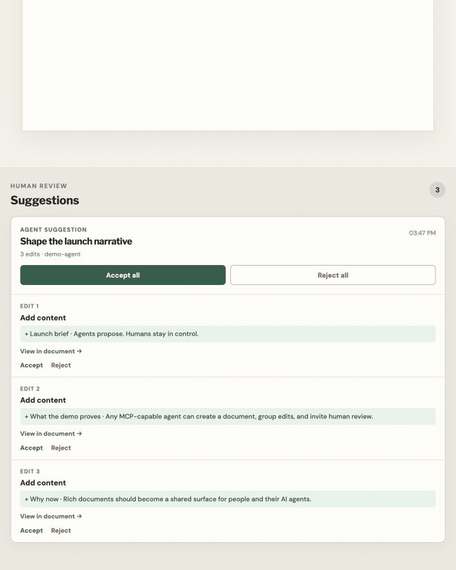
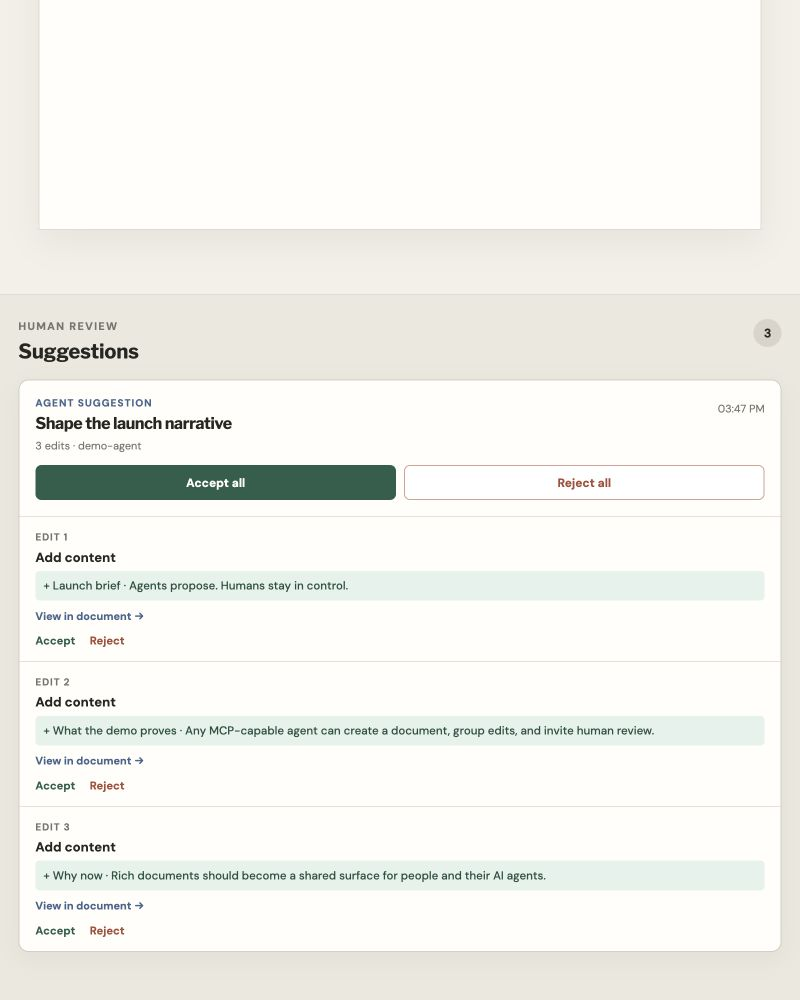
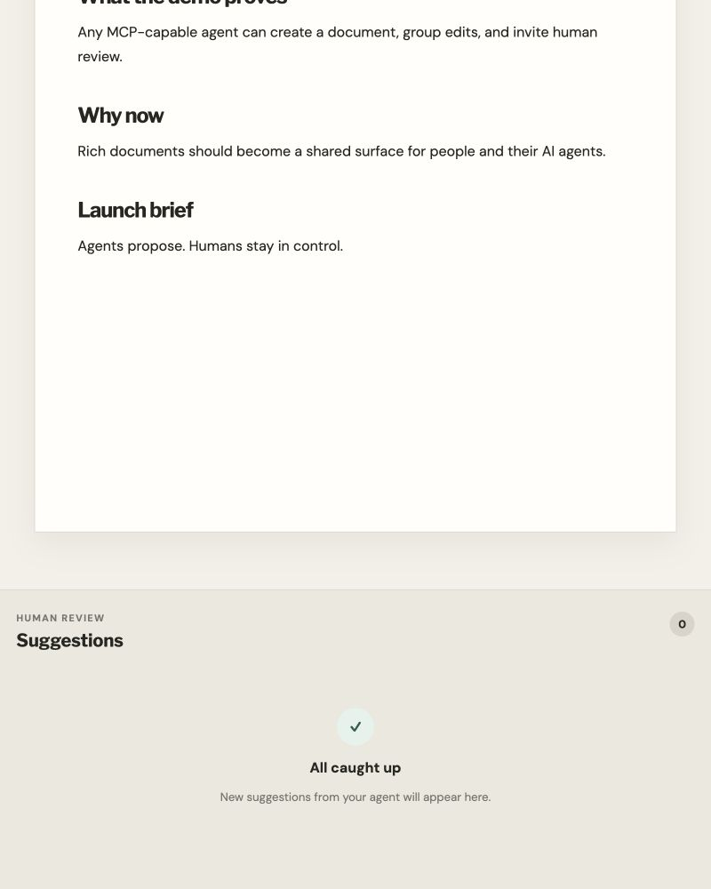
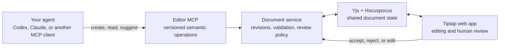

# Editor MCP

**A collaborative rich-text workspace for people and their AI agents.**

Editor MCP gives any MCP-capable agent a document it can create, read, and edit while a human works
in the same Tiptap editor. Agent edits arrive as named suggestions with previews—not as pasted chat
output—so the human can inspect, navigate to, accept, reject, or rewrite every change.

<p align="center">
  
</p>

| Named agent suggestion | Accepted document |
| --- | --- |
|  |  |

The demo deliberately has **no built-in chatbot**. Connect Codex, Claude, or another agent to the MCP
endpoint and keep using the agent you already trust.

## What it proves

- **The agent starts the workspace.** It creates a document and receives a browser URL for the human.
- **The document is genuinely shared.** Agent mutations and human typing converge through Yjs and
  Hocuspocus.
- **Suggestions have intent.** Every agent batch has a short name such as “Shape the launch narrative.”
- **Review works at two levels.** Accept or reject a whole group atomically, or decide on one edit at a
  time.
- **Review is grounded in the document.** The panel shows before/after previews and jumps directly to
  the affected content.
- **The protocol is editor-aware.** Agents use semantic block, text, table, formatting, and review
  operations rather than manipulating arbitrary HTML.

## Run the five-minute demo

You need Node.js 22.13 or newer and pnpm. Node.js 24 is the recommended development version.

```sh
make setup
make demo
```

The demo starts:

- Web app: `http://127.0.0.1:3030`
- Streamable HTTP MCP: `http://127.0.0.1:3030/mcp`

Add that MCP URL to your agent, then ask it:

> Create an Editor MCP document for a launch brief. Add three sections as a suggestion group named
> “Shape the launch narrative,” then give me the editor URL.

Open the returned URL. The document and its Human review panel update live. Try this sequence:

1. Click an edit preview to navigate to its tracked change.
2. Accept one edit individually.
3. Reject or accept the rest as a group.
4. Type directly into the document and ask the agent for another revision.

The local demo uses in-memory persistence and fixed demo identities. Restarting it clears documents;
it is a repeatable product demonstration, not a production deployment.

## The agent contract

The demo exposes three versioned MCP tools:

| Tool | Purpose |
| --- | --- |
| `editor.document.create.v1` | Create a document and return its identity and editor URL |
| `editor.document.read.v1` | Read a revision as agent HTML, ProseMirror JSON, plain text, or outline |
| `editor.document.apply_edits.v1` | Apply an atomic direct edit or named suggestion group |

A suggestion request carries a human-readable group name and one or more semantic operations:

```json
{
  "protocolVersion": 1,
  "changeMode": "suggest",
  "suggestionGroupName": "Tighten the opening",
  "readRevision": "sha256:…",
  "atomic": true,
  "operations": [
    {
      "operationId": "replace-intro",
      "kind": "replace_block",
      "blockId": "block_…",
      "expectedBlockDigest": "sha256:…",
      "html": "<p>A clearer opening for human review.</p>"
    }
  ]
}
```

The `readRevision`, stable block IDs, and expected digests make stale or ambiguous writes fail closed.
The service records a suggestion-group identity for the batch and a logical edit identity for each
operation. Group decisions submit the individual review operations together in one atomic human
request; individual decisions resolve only the chosen logical edit.

## How it fits together



The domain core stays independent from MCP, Tiptap, persistence, and deployment code. Protocol
adapters validate untrusted wire input; the document service owns business policy; the editor
adapter owns the exact ProseMirror schema, stable IDs, transactions, and tracked-change metadata.

## Repository map

| Path | Responsibility |
| --- | --- |
| `apps/demo` | Product demo: MCP endpoint, collaboration server, React/Tiptap app |
| `apps/mcp-server` | Hardened stdio and authenticated Streamable HTTP transports |
| `packages/protocol` | Runtime-owned public schemas and generated TypeScript contracts |
| `packages/core` | Editor-independent semantic operation and policy core |
| `packages/document-service` | Revisioned reads, atomic edits, review rules, and orchestration |
| `packages/adapter-tiptap-hocuspocus` | ProseMirror/Tiptap schema, transformations, diffs, and review |
| `packages/runtime-hocuspocus` | Collaboration persistence, audit, and idempotency runtime |

## Development

```sh
make setup       # install the pinned workspace toolchain
make check       # format, lint, typecheck, build, tests, coverage, package integration
make demo        # build and run the production-shaped local demo
make demo-dev    # run the server and client in watch mode
make help        # list every supported command
```

The workspace uses strict TypeScript, Zod-owned runtime contracts, Vitest with V8 coverage, Tiptap 3,
ProseMirror, Yjs, Hocuspocus, React, and the stable MCP TypeScript SDK v1.

## Production MCP server

`apps/mcp-server` hosts the same editor capability handlers over stdio or authenticated Streamable
HTTP. Every remote environment requires OAuth; there is no insecure production switch.

```sh
pnpm --filter @editor-mcp/mcp-server build
pnpm --filter @editor-mcp/mcp-server test
pnpm --filter @editor-mcp/mcp-server test:integration
pnpm --filter @editor-mcp/mcp-server test:package
pnpm --filter @editor-mcp/mcp-server start

# Authenticated Streamable HTTP after configuring WorkOS staging variables
make mcp-http
```

For local stdio inspection, run `make mcp-inspect`. For remote OAuth, WorkOS, and Railway setup, see
the [production-alpha runbook](docs/remote-mcp-production-alpha.md).

## Design and decisions

- [System architecture](docs/architecture.md)
- [Implementation plan](docs/implementation-plan.md)
- [MVP schema and semantic operations](docs/mvp-schema.md)
- [In-document diffing and tracked changes](docs/diffing-plan.md)
- [MCP protocol deep dive](docs/mcp-deep-dive.md)
- [Remote authorization ADR](docs/adr/0001-remote-mcp-production-auth.md)
- [Development environment and verification](docs/development-environment.md)

Editor MCP is currently an implementation-stage product and protocol. The local demo is ready to
show the end-to-end interaction; production persistence, deployment hardening, and broader client
compatibility remain active work.
