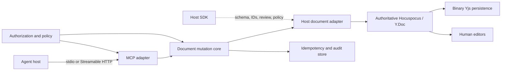

# Editor MCP Architecture

**Status:** Proposed
**Last updated:** 2026-07-17

## 1. Purpose

Editor MCP provides AI agents with a safe, semantic interface for reading and editing live collaborative Tiptap/ProseMirror documents.

The durable product is not an MCP server, an HTML patch format, or a Hocuspocus sidecar by itself. It is a versioned, authorization-aware document mutation system. MCP is the initial agent-facing adapter. Hocuspocus is the initial collaboration backend. HTML is one agent-friendly projection of document content.

This document turns the original [design narrative](./scratch/plan.md) into a proposed system architecture. Decisions that still require product validation are explicitly marked as open.

## 2. Executive decision

The recommended initial architecture is:

- TypeScript end to end for the MCP adapter, mutation core, and Tiptap/Hocuspocus adapter.
- An existing Hocuspocus/Yjs deployment remains the authoritative collaborative document runtime.
- A reusable document mutation core owns operations, validation, preconditions, idempotency, conflicts, and audit metadata.
- A host-supplied adapter owns the exact Tiptap schema, custom extensions, stable ID behavior, tracked changes, and ProseMirror transaction execution.
- Collaboration through Yjs/Hocuspocus is part of the MVP and is tested from the first mutation phase.
- The MVP schema includes tables as well as common text blocks, lists, and inline marks.
- The service owns durable tracked-change semantics and resolution. Clients own visual presentation in Tiptap.
- MCP remains a thin transport adapter supporting local `stdio` and remote Streamable HTTP.
- The first production topology is embedded or colocated with a long-lived Hocuspocus service, not one ephemeral container per document or tool call.
- Yjs binary state is authoritative storage. ProseMirror JSON is the canonical semantic projection. Enriched HTML is an agent-facing convenience format.

Rust is not recommended for v0. Python should be introduced only if a control-plane or workload requirement materially benefits from it.

## 3. Product boundary

### 3.1 Product promise

The system should let an authorized agent:

- Discover the capabilities and schema of a document.
- Read relevant document structure and content without receiving raw ProseMirror transactions or Yjs updates.
- Submit small, structured edit operations against stable targets.
- Receive deterministic validation, conflict, and persistence outcomes.
- Apply edits directly or as reviewable suggestions when the host supports that capability.
- Participate safely in a document that humans may edit concurrently.

### 3.2 Initial positioning

Tiptap now provides a paid, alpha [Server AI Toolkit](https://tiptap.dev/docs/content-ai/capabilities/server-ai-toolkit/overview) with server-side document tools, custom-schema context, and tracked-changes integration. Editor MCP therefore needs an explicit differentiator before becoming a hosted product.

Potential differentiators include:

- Open-source and MCP-native operation.
- Self-hosting without requiring Tiptap Cloud.
- Compatibility with existing Hocuspocus deployments.
- Model- and agent-host-independent interfaces.
- Explicit concurrency, idempotency, audit, and recovery guarantees.
- A path toward supporting collaboration backends and ProseMirror-based editors beyond Tiptap.

The initial implementation should validate this positioning through a build-versus-wrap spike before reproducing proprietary Tiptap features.

### 3.3 Non-goals for v0

- Editing arbitrary Tiptap applications with zero host integration.
- Exposing raw ProseMirror positions, transactions, or Yjs updates to agents.
- Prescribing client-side tracked-change visuals, controls, decorations, gutters, or node views.
- Running a globally distributed, active-active collaboration service.
- Provisioning one container per document or per MCP call.
- Supporting arbitrary executable Tiptap extensions supplied at request time.
- Supporting every custom node, NodeView, table model, comment system, or multi-fragment document.

## 4. Architectural principles

1. **Semantic intent is separate from document mutation.** Agents select and describe edits; deterministic software validates and applies them.
2. **The collaborative document remains authoritative.** HTML and JSON are projections, not primary persistence.
3. **Schema knowledge is explicit.** A Y.Doc alone is insufficient to interpret a Tiptap document safely.
4. **Stable IDs solve addressing, not stale intent.** Target-specific preconditions are still required.
5. **Every mutation is atomic, retry-safe, attributable, and auditable.**
6. **Unsupported operations fail closed.** The system must reject lossy or ambiguous edits rather than silently normalize them.
7. **Transport is replaceable.** MCP, REST, and embedded APIs call the same mutation core.
8. **Deployment follows state ownership.** Stateless protocol gateways may scale elastically; live collaboration state requires an explicit durable owner.

## 5. System context



### 5.1 Component responsibilities

#### MCP adapter

Owns:

- MCP lifecycle and capability negotiation.
- Local `stdio` and remote Streamable HTTP transports.
- MCP authentication and authorization integration.
- Tool and resource registration.
- Structured input/output validation.
- Cancellation and progress propagation.
- Translation between MCP results and domain results.

It does not own collaborative document state or mutation semantics.

#### Document mutation core

Owns:

- Versioned semantic operation contracts.
- Read and edit use cases.
- Target precondition policy.
- Atomic edit batches.
- Idempotency behavior.
- Stable error codes and conflict results.
- Operation authorization hooks.
- Audit and provenance envelopes.
- Deadlines and cancellation before commit.

The core is framework-neutral and does not depend directly on MCP, HTTP, or a particular Hocuspocus server instance.

#### Host document adapter

Owns:

- Access to the canonical live Y.Doc.
- Exact Tiptap version, extensions, schema, and collaboration field.
- ProseMirror document materialization and validation.
- Stable block ID generation and lookup.
- Constrained HTML and Tiptap JSON parsing.
- ProseMirror transaction construction and plugin execution.
- Tracked-changes or review-mode integration.
- Transaction origins, undo policy, and host-specific behavior.

This boundary is required because custom Tiptap extensions are executable behavior, not only serializable schema definitions.

#### Hocuspocus/Yjs runtime

Owns:

- Authoritative in-memory collaborative state for active documents.
- WebSocket synchronization.
- Loading and storing Yjs binary state.
- Collaboration lifecycle hooks.
- Awareness and connected-client state.
- Document unloading after a verified persistence boundary.

[Hocuspocus v4](https://tiptap.dev/docs/hocuspocus/server/usage) supports direct server-side document connections and requires Node.js 22 or later for its Node deployment.

#### Host SDK

Provides:

- Schema and adapter registration.
- Schema version or fingerprint.
- Collaboration field names.
- Supported node and mark capabilities.
- Stable ID extension configuration.
- Review adapter configuration.
- Optional client-side presence and review UI integration.

## 6. Integration modes

The word "sidecar" must not hide different ownership models.

### 6.1 Embedded or colocated adapter — recommended v0

The adapter runs inside, or beside, the customer's Hocuspocus service and uses the same Hocuspocus instance through a direct connection.

Benefits:

- Lowest synchronization latency.
- Access to the canonical in-memory document.
- Shared schema and runtime dependencies.
- Cleanest persistence acknowledgement path.
- Fewer credentials and network trust boundaries.

Tradeoffs:

- Runtime and deployment coupling.
- Shared failure domain.
- Customer upgrade responsibility for self-hosted deployments.

### 6.2 Remote Yjs client — later

The adapter connects as an authenticated Hocuspocus provider, waits for synchronization, applies an operation, observes persistence, and disconnects.

This is more portable but introduces synchronization latency, an additional authorization boundary, stale-read windows, and more complicated durability acknowledgement.

### 6.3 Managed collaboration service — future

Editor MCP operates Hocuspocus, persistence, authorization, WebSockets, backups, tenancy, and regional routing. This is a substantially larger product and should not be implied by the initial MCP implementation.

### 6.4 Managed-provider adapter — optional

The mutation core calls Tiptap Cloud or Tiptap Server AI Toolkit APIs. This may reduce implementation and operational work but introduces product licensing and vendor coupling.

## 7. Document and schema model

### 7.1 Document identity

A document must not be identified by a user-visible slug or Hocuspocus document name alone. The internal identity should include:

```text
tenant_id
document_id
document_incarnation
collaboration_field
schema_id
schema_version
```

`document_incarnation` prevents a stale operation from applying to a newly created document that reused an old external name.

### 7.2 Representations

| Representation | Purpose | Authority |
|---|---|---|
| Yjs binary updates/snapshots | Collaboration persistence and recovery | Authoritative |
| ProseMirror JSON | Canonical semantic validation and hashing | Derived but canonical for semantics |
| Enriched HTML | Agent-readable content and simple edit fragments | Convenience projection |
| Plain text/outline | Search, previews, and token-efficient context | Convenience projection |

Hocuspocus warns against reconstructing collaborative documents repeatedly from HTML or JSON because doing so creates new collaboration history and can duplicate content. [Persistence guidance](https://tiptap.dev/docs/hocuspocus/guides/persistence)

### 7.3 Stable IDs

Stable IDs must be persisted node attributes, not values generated during HTML serialization.

The initial policy should require:

- Opaque random IDs.
- Uniqueness within a collaboration field.
- IDs generated by the adapter, never trusted from model-produced HTML.
- Explicit split, merge, paste, duplicate, import, and restore behavior.
- New IDs for newly inserted nodes.
- Preservation of IDs for localized text and formatting operations and for moving an existing node.
- Retirement of the target ID for every `replace_block`, with fresh server-owned IDs assigned to
  every addressable node in the replacement subtree.
- A new ID for every block type change, including a one-to-one type change.
- Rejection when a target ID is missing or duplicated.

Tiptap's [UniqueID extension](https://tiptap.dev/docs/editor/extensions/functionality/uniqueid) can provide the reference implementation, but initialization and collaboration synchronization order must be tested carefully.

### 7.4 Schema registration

Each document type must register a server-safe extension bundle. The adapter needs the exact extension list and configuration to parse and validate content correctly.

The system must never load arbitrary extension code received from an MCP or HTTP request. Adapters are registered at deployment time and selected by an authenticated schema identifier.

## 8. Semantic operation contract

### 8.1 Minimal operations

The initial operation set is deliberately small:

- `insert_before`
- `insert_after`
- `replace_block`
- `delete_block`

Later versions may add constrained inline replacement, attribute updates, comments, and structured table operations.

### 8.2 Read result

A read should return:

```json
{
  "documentId": "doc_123",
  "documentIncarnation": "inc_1",
  "schemaVersion": "article/v1",
  "revision": "opaque-revision",
  "capabilities": {
    "reviewModes": ["suggest"],
    "operations": ["insert_before", "insert_after", "replace_block", "delete_block"]
  },
  "representation": {
    "profile": "agent-html/v1",
    "html": "<h2 data-block-id=\"blk_1\">Study Objectives</h2>"
  },
  "blocks": [
    {
      "id": "blk_1",
      "nodeType": "heading",
      "contentDigest": "sha256:..."
    }
  ]
}
```

The revision is opaque. Block digests should be computed from canonical ProseMirror JSON rather than HTML serialization.

### 8.3 Edit request

```json
{
  "documentId": "doc_123",
  "documentIncarnation": "inc_1",
  "schemaVersion": "article/v1",
  "idempotencyKey": "idem_123",
  "readRevision": "opaque-revision",
  "atomic": true,
  "changeMode": "suggest",
  "suggestionGroupName": "Refresh project objectives",
  "operations": [
    {
      "operationId": "op_1",
      "kind": "replace_block",
      "blockId": "blk_1",
      "expectedBlockDigest": "sha256:...",
      "html": "<h2>Updated objectives</h2>"
    }
  ]
}
```

All operations in a request are validated against one live document state and committed atomically.
Suggested requests require a short agent-authored group name. The committed change-set ID is the
stable suggestion-group identity; every operation remains an independently addressable review unit.

### 8.4 Edit result

The result should include:

- Applied, conflict, duplicate, or failed status.
- Committed revision.
- Change-set ID.
- Whether the result was an idempotent replay.
- Created and affected block IDs.
- Durable acknowledgement level.
- Machine-readable conflicts.

### 8.5 Error taxonomy

`editorErrorCodeSchema` in `packages/protocol/src/errors.ts` is the authoritative public error-code
taxonomy. Public error envelopes are strict, versioned values containing a stable code, a bounded
safe message, retryability, and an optional opaque correlation ID. Tool-specific recovery details
are intentionally deferred until their contracts exist; untyped details are not allowed.

The domain core owns framework-neutral failure reasons. MCP and HTTP adapters map those reasons
exhaustively into the public protocol schema. MCP protocol failures continue to use the MCP SDK's
JSON-RPC errors; expected editor failures use the public editor error envelope. Public errors must
not expose document content, ProseMirror internals, stack traces, or storage details.

## 9. Concurrency and idempotency

### 9.1 Concurrency model

Yjs guarantees convergence, not preservation of semantic intent. A target-specific digest is therefore the main optimistic concurrency precondition.

Recommended behavior:

- Replacement and deletion require an exact expected block digest.
- Insertion requires the anchor to exist and may optionally require an anchor digest.
- Unrelated document changes do not automatically invalidate an operation.
- A materially changed target returns `TARGET_CHANGED` with enough current metadata to support a reread.
- The adapter never silently rebases a semantic replacement over changed target content.

### 9.2 Atomicity

One edit request produces either:

- One complete Yjs/ProseMirror mutation, or
- No document change.

Mutation callbacks must not perform network or storage awaits while the document transaction is open.

### 9.3 Idempotency

Yjs update idempotency does not make a generated semantic command retry-safe. The system needs a durable ledger scoped to:

```text
tenant + principal + document + idempotency_key
```

Rules:

- Same key and same canonical request returns the original result.
- Same key and different request returns `IDEMPOTENCY_MISMATCH`.
- Concurrent requests with the same key permit only one mutation.
- The ledger records request hash, before/after revision, generated IDs, change-set ID, and final outcome.

### 9.4 Cancellation

- Cancellation is honored before commit and at safe validation checkpoints.
- Once the document transaction commits, the system reports or recovers the committed result rather than attempting an implicit rollback.
- A dropped connection is not equivalent to cancellation.

## 10. Review and tracked changes

Reviewable edits are part of the MVP. Their durable semantic representation is stored in the collaborative document and synchronized through Yjs. The service defines how changes are created, grouped, validated, accepted, rejected, serialized, and recovered.

The server-side review contract must define:

- Addition, deletion, replacement, and mark-change representation.
- Suggestion IDs and authenticated authorship.
- A short agent-authored name and stable identity for each suggestion group.
- Independent edit resolution inside a group plus atomic accept/reject of every pending group edit.
- Table and atom-node behavior.
- Accept and reject operations.
- Effective document content while suggestions are pending.
- Interaction with collaboration and undo history.

The client application decides how pending changes are rendered and where review controls appear. Decorations, node views, colors, gutters, hover cards, previews, navigation, and controls are outside the service contract. Clients derive presentation from synchronized change marks, node attributes, metadata, and semantic status supplied by the service.

Accepting or rejecting a suggestion is a separate authorized mutation. Agent principals are never
allowed to accept or reject suggestions, even when a custom permission policy is configured too
broadly. Human or explicitly trusted service principals require `suggestions:review`.

## 11. MCP interface

### 11.1 Transports

- Local clients use `stdio`.
- Remote clients use Streamable HTTP at a stable endpoint such as `/mcp`.
- Logging from a `stdio` server goes to stderr, never stdout.
- The Hocuspocus WebSocket endpoint is not an MCP transport.

MCP sessions are transport state, not document identity or authentication state. Every operation includes an explicit document ID.

### 11.2 Minimal tools

#### `editor.document.create.v1`

Creates one durable blank collaborative document using server-owned identity, then returns its
initial revision and hosted editor URL. Content authored by an agent is submitted afterward through
`apply_edits` so it remains reviewable.

#### `editor.document.read.v1`

Reads all or selected blocks and returns structured content, revisions, digests, and capabilities.

#### `editor.document.apply_edits.v1`

Applies one atomic batch of semantic operations with idempotency and target preconditions.

One edit-batch tool is preferred over separate insert, replace, and delete tools because it provides one tool-selection surface and one atomic/idempotency boundary.

### 11.3 Resources

Potential resource templates:

```text
editor://documents/{document_id}
editor://documents/{document_id}/blocks/{block_id}
```

Resource listing and reading must be filtered by the authenticated principal.

### 11.4 Deferred MCP features

- Prompts.
- Resource subscriptions.
- Elicitation.
- Experimental MCP tasks.
- Multi-document transactions.
- Accept/reject tools.
- Search and query DSLs.

## 12. Security and trust boundaries

### 12.1 Principals

The system distinguishes:

- Human user.
- MCP host/client.
- Agent execution or service principal.
- Editor MCP service.
- Host application.
- Hocuspocus service.

### 12.2 Authorization

Initial permissions:

- `documents:read`
- `documents:suggest`
- `documents:write`
- `suggestions:review`
- `comments:read`
- `comments:write`

Remote MCP authentication does not replace document-level authorization. The MCP access token must not be forwarded unchanged to Hocuspocus or another downstream API. MCP explicitly forbids token passthrough because it breaks token audience and audit boundaries. [MCP authorization](https://modelcontextprotocol.io/specification/2025-11-25/basic/authorization)

### 12.3 Untrusted content

Treat as hostile:

- Existing document content.
- Model-produced HTML and JSON.
- URLs and node attributes.
- Custom schema metadata.
- MCP tool arguments.
- Yjs binary input from clients.

Controls include:

- Strict request schemas and unknown-field rejection.
- Body, HTML, node-count, depth, and execution limits.
- Structural allowlists and safe URL schemes.
- Parsing through the exact Tiptap schema.
- Detection of content silently removed during parsing.
- Server-derived IDs, authorship, and timestamps.
- Tenant-level object authorization at every read and write.
- Prompt-injection-aware separation between document content and tool authority.

## 13. Durability, recovery, and audit

### 13.1 Acknowledgement boundary

The production API should acknowledge an edit only after:

1. Authorization and validation succeed.
2. Preconditions match the live document.
3. The atomic mutation commits.
4. The idempotency outcome is durable.
5. The selected document persistence boundary is durable.
6. The audit event is recorded or durably queued.

### 13.2 Recovery state

Maintain:

- Compacted Yjs snapshots.
- Exact incremental Yjs updates or an equivalent recoverable journal.
- Durable operation receipts.
- Append-only audit metadata.

HTML and JSON snapshots may be retained for inspection or search but cannot replace Yjs recovery data.

### 13.3 Audit envelope

Each accepted mutation should record:

- Tenant and opaque document references.
- Authenticated actor and agent-run identity.
- Operation and change-set IDs.
- Request and idempotency hashes.
- Schema and adapter versions.
- Target preconditions.
- Before and after revisions/hashes.
- Generated block and suggestion IDs.
- Authorization decision.
- Outcome and durable acknowledgement level.
- Trace ID and server timestamp.

Document text, HTML, tokens, and user secrets must not appear in ordinary logs or metric labels.

## 14. Language and runtime

### 14.1 TypeScript — selected

TypeScript is the recommended v0 language because it provides:

- Native Tiptap, ProseMirror, Hocuspocus, and Yjs integration.
- A shared schema/type system across MCP and document mutation.
- Direct use of Zod for runtime validation and JSON Schema generation.
- One build, test, tracing, and dependency ecosystem.
- The least risk of semantic drift between host and sidecar schemas.

Use the stable production line of the official [MCP TypeScript SDK](https://github.com/modelcontextprotocol/typescript-sdk), not a prerelease line, until conformance testing supports an upgrade.

### 14.2 Python — conditional

Python may be used later for:

- A platform-native provisioning control plane.
- Offline NLP or document-analysis workloads.
- Batch pipelines with strong Python ecosystem dependencies.

Python should not duplicate Tiptap schema validation or document mutation logic.

### 14.3 Rust — deferred

Rust has an official [MCP SDK](https://github.com/modelcontextprotocol/rust-sdk), and [Yrs](https://github.com/y-crdt/y-crdt) is binary-compatible with Yjs. It is still a poor v0 fit because exact Tiptap schemas, ProseMirror plugins, tracked changes, and transaction behavior live in the JavaScript ecosystem.

Rust should be reconsidered only if profiling or portability requirements justify:

- A sandboxed parser or validator.
- A WASM-distributed pure operation engine.
- CPU-bound transformations.
- A non-JavaScript collaboration backend.

## 15. Deployment and provisioning

### 15.1 State classification

May be ephemeral:

- Stateless MCP gateways.
- Import/export workers.
- Large asynchronous transformations.
- Validation jobs that do not own live state.
- Short-lived workers joining an already-authoritative Hocuspocus deployment.

Should initially be long-lived:

- The collaboration authority.
- Active Y.Doc ownership.
- WebSocket routing.
- Persistence coordination.
- Idempotency and audit stores.

### 15.2 Recommended stages

#### Stage 0: local and embedded

- Reusable TypeScript core.
- Embedded Hocuspocus adapter.
- Local `stdio` MCP server.
- One supported Tiptap schema profile.

#### Stage 1: long-lived single-tenant service

- One region.
- One active owner per document.
- Durable Yjs persistence.
- Production authentication, audit, and recovery.

#### Stage 2: managed regional pools

- Stateless MCP/control gateway.
- Regional document router.
- Warm Hocuspocus shard pools hosting multiple active documents.
- External tenant-partitioned persistence.
- Per-tenant quotas and circuit breakers.

#### Stage 3: dedicated tenant deployments

For customers requiring private networking, customer-managed keys, strict data residency, or dedicated compute.

#### Stage 4: selective ephemeral optimization

Adopt operation-scoped ephemeral workers only after measuring document activation frequency, synchronization latency, persistence cost, and worker lifecycle overhead.

### 15.3 Modal and scale-to-zero platforms

Modal supports WebSockets and scale-to-zero functions, but an active WebSocket keeps work active and a cold operation must still retrieve credentials, connect, synchronize the Y.Doc, initialize the schema, and construct projections. [Modal Web Functions](https://modal.com/docs/guide/webhooks)

Modal is plausible for stateless gateways and batch workers. It should not be the default authoritative collaboration runtime without a measured prototype demonstrating acceptable synchronization, durability, routing, and cost.

MCP itself does not dynamically provision arbitrary sidecars. Local MCP hosts launch a configured `stdio` process; remote hosts connect to an already deployed Streamable HTTP endpoint. Provisioning therefore belongs to installation, onboarding, or a separate control plane. [MCP architecture](https://modelcontextprotocol.io/docs/learn/architecture)

## 16. Repository architecture

```text
Editor-MCP/
├── apps/
│   ├── mcp-server/
│   └── reference-server/
│   ├── visual-test-harness/
│   └── demo/
├── packages/
│   ├── protocol/
│   ├── core/
│   └── adapter-tiptap-hocuspocus/
├── examples/
│   └── basic/
├── test/
│   └── fixtures/
├── docs/
├── pnpm-workspace.yaml
├── tsconfig.base.json
├── eslint.config.mjs
└── vitest.config.ts
```

### 16.1 Package responsibilities

| Package | Responsibility |
|---|---|
| `@editor-mcp/protocol` | Public versioned Zod schemas, inferred wire types, error envelopes, generated JSON Schema |
| `@editor-mcp/core` | Framework-neutral read/edit use cases, policies, ports, and domain errors |
| `@editor-mcp/adapter-tiptap-hocuspocus` | Tiptap schema, HTML/JSON conversion, ProseMirror/Yjs mutation, direct Hocuspocus access |
| `apps/mcp-server` | MCP transports and tool/resource registration |
| `apps/reference-server` | Runnable Hocuspocus reference integration and HTTP composition root |
| `apps/visual-test-harness` | Browser-visible fixture matrix showing before, proposed, accepted, and rejected editor states |
| `apps/demo` | Finished agent-plus-multiple-editors product demonstration |

Dependencies flow inward toward protocol and core. Packages do not import another package's private `src` files.

## 17. TypeScript and schema quality

### 17.1 Runtime and modules

- Node 24 LTS for production.
- Node 22 minimum.
- ESM-only packages.
- `module` and `moduleResolution` set to `NodeNext`.
- Explicit package `exports` maps.
- Libraries built with `tsc` project references.
- Avoid bundling libraries until distribution requirements justify it.

### 17.2 Compiler posture

Enable at least:

```text
strict
noUncheckedIndexedAccess
exactOptionalPropertyTypes
useUnknownInCatchVariables
noImplicitOverride
noPropertyAccessFromIndexSignature
noFallthroughCasesInSwitch
noUncheckedSideEffectImports
verbatimModuleSyntax
forceConsistentCasingInFileNames
```

### 17.3 Zod strategy

- Zod 4 schemas are the source of truth for public wire formats.
- Infer TypeScript types with `z.infer`; do not duplicate interfaces.
- Use discriminated unions for edit operations.
- Reject unknown request properties.
- Generate JSON Schema 2020-12 artifacts from Zod.
- Keep transforms and non-JSON runtime values out of public schemas.
- Validate external boundaries rather than wrapping every internal value in Zod.

## 18. Development workflow

Use pnpm workspaces and root scripts as the canonical task interface.

```text
pnpm dev
pnpm test
pnpm test:integration
pnpm test:e2e
pnpm typecheck
pnpm lint
pnpm format
pnpm format:check
pnpm build
pnpm check
```

`pnpm check` should run formatting checks, typed linting, type checking, unit and integration tests, coverage, generated-schema verification, and production builds.

A Makefile may provide convenient aliases such as `make check`, but it must delegate to package scripts and contain no competing build logic.

Recommended tools:

- Vitest with V8 coverage.
- `fast-check` for property and model-based tests.
- Playwright for multi-client browser tests.
- ESLint flat configuration with typed `typescript-eslint` rules.
- Prettier for formatting.
- Changesets when public package releases begin.

## 19. Testing strategy

### 19.1 Required correctness invariants

Every accepted edit must satisfy:

1. The resulting ProseMirror document is schema-valid.
2. Only intended targets and unavoidable structural ancestors changed.
3. Atomic batches never partially apply.
4. Retrying an operation produces one semantic effect.
5. Stale target content produces a conflict.
6. All Yjs clients converge after receiving updates.
7. Acknowledged edits survive persistence and reload.
8. Cross-tenant reads and writes are impossible.
9. Review-mode accept/reject behavior matches the host adapter's declared contract.
10. Every mutation has complete authenticated provenance.

### 19.2 Test layers

#### Unit and contract

- Protocol schema acceptance and rejection.
- Operation planning.
- Error mapping.
- Target precondition policy.
- Idempotency state machine.
- HTML allowlisting and canonicalization.
- Stable ID behavior.

#### Property and model based

- Generated valid ProseMirror documents.
- Generated edit sequences.
- Unicode, RTL, nested structures, and malformed fragments.
- Duplicate IDs and stale operations.
- Deterministic replay of failing seeds.

#### Integration

- Real Hocuspocus server.
- Production-equivalent persistence adapter.
- At least two Yjs clients plus one agent mutation.
- Load, mutate, store, unload, reload, and reconverge.
- Duplicate and reordered updates.
- Controlled database failure.

#### Visual fixture harness

Every diff fixture must be usable by both automated tests and a browser-visible Tiptap harness. A fixture produces four independently materialized editor states:

```text
before
  Original collaborative document before the agent operation.

proposed
  Document after the tracked operation is applied.

accepted
  A fresh copy of proposed state after accepting the change.

rejected
  A separate fresh copy of proposed state after rejecting the change.
```

The harness presents these states side by side, includes the semantic operation and expected invariants, and supports filtering by node type, operation, and edge case. Accepted and rejected are sibling outcomes, never sequential mutations of the same instance.

The same fixture must assert canonical ProseMirror JSON, clean projections, tracking metadata, schema validity, and Yjs convergence. Visual inspection supplements these assertions; it does not replace them.

#### End to end

- Two browser editors and one agent.
- Fixture routes that reproduce every automated diff case as before/proposed/accepted/rejected Tiptap editors.
- Visible direct or suggested edit.
- Conflict and reread flow.
- Accept/reject when supported.
- Offline reconnect and persistence reload.
- Malicious HTML rendered inert.

#### Nightly and release

- Large fuzz/model runs.
- Concurrency schedule exploration.
- Yjs binary-input fuzzing.
- Restore and replay drills.
- Load and failure-injection tests.
- Supported runtime, browser, and dependency matrix.

### 19.3 Coverage

Initial targets:

- 85% lines and functions globally.
- 80% branches globally.
- 100% branch coverage for operation discriminants, target precondition policy, and public error mapping.

Coverage is a secondary signal. Concurrency, persistence, compatibility fixtures, and generated-document tests are more important than maximizing a single percentage.

## 20. Observability

Trace the complete mutation path:

```text
MCP/HTTP request
→ authentication
→ document authorization
→ document load/sync
→ parse and validation
→ precondition check
→ ProseMirror/Yjs transaction
→ persistence
→ collaboration broadcast
→ audit
→ response
```

Initial metrics:

- Read and edit success/error/conflict rates.
- Idempotent replay count.
- Validation, mutation, persistence, and broadcast latency.
- Initial synchronization and reconnect latency.
- Active documents, clients, and loaded Y.Doc bytes.
- Update and snapshot sizes.
- Persistence lag.
- Schema, sanitization, and resource-limit rejection rates.
- Audit omissions and restore/replay failures.

Do not use raw document or user IDs as metric dimensions.

## 21. MVP compatibility envelope

- Tiptap 3.
- Hocuspocus 4.
- Node 22 and 24.
- One configured `Y.XmlFragment` field per document.
- One server-safe, versioned extension bundle based initially on StarterKit plus tables and the Editor MCP tracking extensions.
- Stable UUID node attributes installed before agent editing.
- Paragraphs, headings, blockquotes, bullet lists, ordered lists, list items, code blocks, horizontal rules, hard breaks, tables, table rows, table headers, table cells, and text.
- Bold, italic, strike, inline code, and link marks.
- Block-level and localized text read, insert, replace, delete, and format operations.
- Structured table row and column operations.
- Constrained HTML fragments plus canonical ProseMirror JSON validation.
- Reviewable edits, durable change metadata, and accept/reject operations.
- Yjs/Hocuspocus collaboration and multi-client convergence from the first production phase.
- No generic AI cursor or awareness behavior.
- No custom NodeViews, subdocuments, pages, media nodes, task lists, or arbitrary atom nodes until individually certified.

## 22. Delivery sequence

### Phase 0: product and contract decisions

Produce:

1. A product contract and differentiation from Tiptap Server AI Toolkit.
2. A document identity and schema adapter specification.
3. A mutation, conflict, idempotency, and durability specification.
4. A review/tracked-changes decision.
5. Deployment ADRs for embedded, remote-client, and managed-service modes.

### Phase 1: production foundation

Build with production package boundaries and test-first contracts:

- The versioned MVP schema, including tables and tracking extensions.
- A production Hocuspocus/Yjs document lifecycle.
- Stable block IDs.
- Versioned read and atomic edit contracts.
- The first vertical operation implemented through the production mutation core and adapter.
- Target digest conflicts.
- Durable idempotency.
- Two concurrent Yjs clients.
- Persistence and reload verification.
- CI-grade unit, contract, integration, convergence, and recovery tests.

### Phase 2: complete semantic mutation surface and local MCP

- Extract versioned Zod schemas.
- Implement the mutation core and adapter ports.
- Add local `stdio` MCP.
- Add atomic operation batches.
- Add generated-document and concurrency tests.
- Add localized text operations and structured table operations incrementally behind passing contract and integration tests.

### Phase 3: remote production service

- Remote Streamable HTTP MCP.
- OAuth and document authorization.
- Durable audit and recovery journal.
- Operational limits, telemetry, and runbooks.
- Collaborative tracked-change resolution, client-facing change data, and accept/reject APIs.

### Phase 4: managed deployment experiments

- Measure real document sizes, update rates, and synchronization latency.
- Compare warm pooled services with operation-scoped ephemeral workers.
- Validate cost, regionality, recovery, and tenant isolation before selecting a managed platform.

## 23. Open decisions

The following must be resolved before committing to a production architecture:

- Is the primary product a private MCP server, hosted service, or both in stages?
- What is the concrete advantage over Tiptap Server AI Toolkit?
- What exact durable tracked-change representation and metadata layout will the service certify?
- Does v0 require self-hosting and strict data residency?
- Will customers already operate Hocuspocus, or will Editor MCP eventually own collaboration infrastructure?
- What precise acknowledgement and recovery guarantees are promised?
- Are any additional nodes or marks required beyond the defined MVP compatibility envelope?
- Direct mutations are reserved for human and service principals; agent principals must always use
  `changeMode: "suggest"` so edits remain reviewable.
- Is multi-document discovery and editing part of the initial use case?
- What document sizes, latency, concurrency, availability, RPO, and RTO targets define success?

## 24. Follow-up ADRs

Create focused Architecture Decision Records for:

1. Product boundary and Tiptap build/wrap decision.
2. Embedded versus remote document adapter.
3. Canonical representations and agent HTML profile.
4. Stable block ID lifecycle.
5. Semantic conflict and idempotency model.
6. Review/tracked-changes implementation.
7. Durability acknowledgement and recovery journal.
8. Local and remote MCP transports.
9. Managed hosting topology.
10. Public package and protocol versioning.

## 25. Primary references

- [Model Context Protocol architecture](https://modelcontextprotocol.io/docs/learn/architecture)
- [MCP authorization](https://modelcontextprotocol.io/specification/2025-11-25/basic/authorization)
- [Official MCP TypeScript SDK](https://github.com/modelcontextprotocol/typescript-sdk)
- [Hocuspocus server usage](https://tiptap.dev/docs/hocuspocus/server/usage)
- [Hocuspocus hooks](https://tiptap.dev/docs/hocuspocus/server/hooks)
- [Hocuspocus persistence](https://tiptap.dev/docs/hocuspocus/guides/persistence)
- [Tiptap UniqueID extension](https://tiptap.dev/docs/editor/extensions/functionality/uniqueid)
- [Tiptap Server AI Toolkit](https://tiptap.dev/docs/content-ai/capabilities/server-ai-toolkit/overview)
- [Tiptap Tracked Changes](https://tiptap.dev/docs/tracked-changes/getting-started/overview)
- [Yjs document updates](https://docs.yjs.dev/api/document-updates)
- [Yjs document API](https://docs.yjs.dev/api/y.doc)
- [ProseMirror reference](https://prosemirror.net/docs/ref/)
- [Zod JSON Schema generation](https://zod.dev/json-schema)
- [Vitest coverage](https://vitest.dev/guide/coverage.html)
