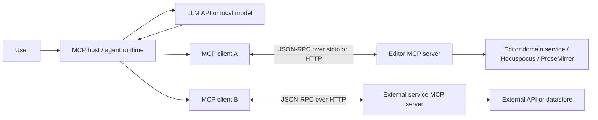
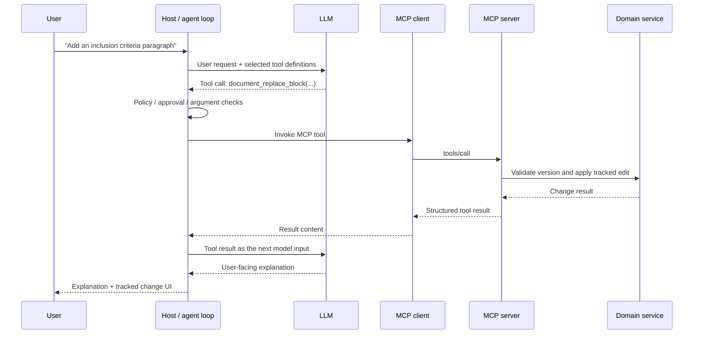
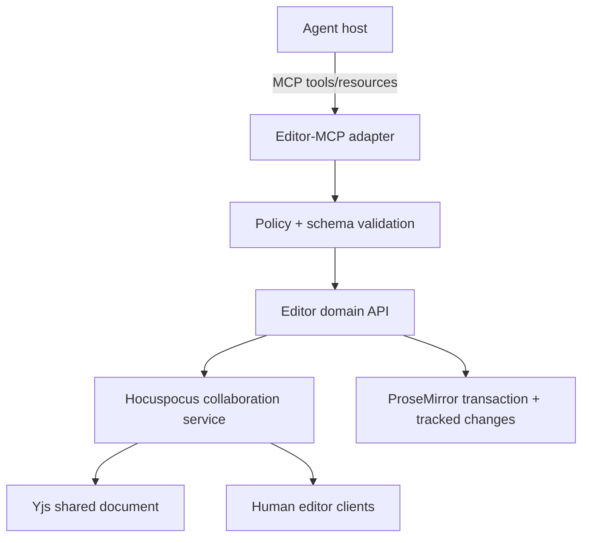

# Model Context Protocol (MCP): Architecture, Agent Communication, SDKs, and Frameworks

> Research snapshot: July 17, 2026
>
> Scope: Model Context Protocol architecture, how MCP information reaches an AI agent, the protocol's wire model, server-building SDKs and frameworks, security, testing, and implications for Editor-MCP.

## Contents

1. [What MCP is—and what it is not](#1-what-mcp-isand-what-it-is-not)
2. [The complete communication path](#2-the-complete-communication-path)
3. [How each kind of information reaches an agent](#3-how-each-kind-of-information-reaches-an-agent)
4. [The wire protocol](#4-the-wire-protocol)
5. [The July 2026 transition](#5-the-july-2026-transition-stable-vs-release-candidate)
6. [Official SDKs](#6-official-sdks)
7. [Higher-level frameworks and deployment adapters](#7-higher-level-frameworks-and-deployment-adapters)
8. [Agent frameworks and hosts that consume MCP](#8-agent-frameworks-and-hosts-that-consume-mcp)
9. [Designing an effective MCP server](#9-designing-an-effective-mcp-server)
10. [Authentication, authorization, and security](#10-authentication-authorization-and-security)
11. [Testing, debugging, and operations](#11-testing-debugging-and-operations)
12. [Recommendation for Editor-MCP](#12-recommendation-for-editor-mcp)
13. [Decision guide](#13-decision-guide)
14. [Primary references](#14-primary-references)

## Executive summary

The Model Context Protocol is a standard interface between an AI application and external capabilities. It is not an LLM, an agent loop, a memory system, or an orchestration framework. It standardizes discovery and invocation: a server describes tools, resources, prompts, and related capabilities; an MCP client exchanges those descriptions and results with the server; and an MCP host decides what to expose to the model and user.

The most important architectural point is that an MCP server usually does **not** communicate directly with an LLM. The path is:

```text
MCP server <-> MCP client inside a host <-> host's agent/model loop <-> LLM
```

For tools, the host normally converts MCP tool definitions into the model provider's function/tool schema. The model selects a tool and produces arguments. The host sends a `tools/call` request to the MCP server, receives the result, and adds that result to a later model turn. The host remains the policy and presentation boundary throughout.

MCP's three central server primitives deliberately have different controllers:

| Primitive | Typical controller | Purpose |
|---|---|---|
| Tools | Model-controlled | Run an operation or query with typed inputs |
| Resources | Application-controlled | Read addressable context such as files, schemas, or records |
| Prompts | User-controlled | Instantiate reusable message templates or workflows |

The latest **final** protocol revision at the date of this report is `2025-11-25`. It is stateful: the client performs an initialization handshake, negotiates a protocol version and capabilities, and may receive an HTTP session ID. A breaking `2026-07-28` revision is currently a release candidate and is scheduled to become final on July 28, 2026. It removes the initialization handshake and protocol-level sessions, makes requests self-contained, promotes extensions, and deprecates roots, sampling, and protocol logging. Production code should pin a final SDK/spec combination and treat release-candidate support as an explicit migration track, not an invisible upgrade.

For this repository, the best default is the official TypeScript SDK because the editor stack is already conceptually close to ProseMirror/Hocuspocus and TypeScript. Ship against the supported v1 line today, expose Streamable HTTP for a remote/shared sidecar, and plan a deliberate v2 migration after the `2026-07-28` specification and SDK releases are final. The MCP layer should stay thin: it should translate typed agent requests into deterministic editor-domain commands, not expose raw ProseMirror transactions.

## 1. What MCP is—and what it is not

MCP standardizes a boundary that used to be rebuilt for every agent/integration pair. Without MCP, a host must learn a unique API, auth flow, discovery format, and result representation for every database, editor, filesystem, SaaS product, or internal service. With MCP, the host implements one protocol-facing client and each provider implements one protocol-facing server.

The official [architecture overview](https://modelcontextprotocol.io/docs/learn/architecture) defines three participants:

- **Host:** the user-facing AI application. It owns the model connection, conversation, permissions, UI, and one or more MCP clients.
- **Client:** a protocol component managed by the host. A host normally creates one MCP client per MCP server connection.
- **Server:** a local process or remote service that exposes context and actions through MCP.

MCP separates two layers:

- The **data layer** defines JSON-RPC messages, lifecycle, capability negotiation, primitives, and notifications.
- The **transport layer** carries those messages over stdio, Streamable HTTP, or a custom binding.

The specification intentionally does not define how a host constructs prompts, chooses a model, runs an agent loop, stores memory, approves actions, or decides which returned content reaches the model. This is why the same MCP server can behave differently in different hosts.

### MCP is not an agent-to-agent protocol

MCP is primarily a capability and context protocol between a host/client and a server. A server may contain its own agents or request client features, but MCP does not by itself define agent identity, delegation semantics, team formation, or peer-to-peer agent negotiation. A multi-agent framework can use MCP as its common tool boundary, but the framework still owns orchestration.

### MCP is not a replacement for the underlying domain API

An MCP server is usually an adapter over a real system of record: a REST/GraphQL API, database, editor transaction layer, SDK, queue, or filesystem. Domain invariants, authorization, concurrency control, validation, and audit logging still belong in deterministic software. MCP gives agents a stable, model-legible interface to that software.

### MCP is not automatically secure

Standardized messages do not create a security boundary. Local servers run code with the privileges of the process that launched them. Remote servers require real authentication and authorization. Tool descriptions and annotations are claims from a server, not enforcement. Roots communicate intended filesystem scope but do not sandbox a process. The host must combine allowlists, approvals, OS isolation, network policy, and domain-level authorization.

## 2. The complete communication path

The following diagram shows where MCP stops and the agent framework begins.



The host is the trust and translation boundary. It may:

- filter or rename tools;
- convert JSON Schema into a provider-specific tool schema;
- add server instructions to a system prompt, ignore them, or show them to the user;
- let the user select resources or load them automatically;
- expose prompts as slash commands;
- require approval before a tool call;
- redact arguments or results;
- truncate, summarize, cache, or reject content;
- route a tool result back to the model, only to the UI, or to both.

This explains a common source of confusion: saying that an MCP server “gives a tool to the model” is useful shorthand, but technically the server gives a tool definition to the client, and the host chooses how to represent it to the model.

## 3. How each kind of information reaches an agent

### 3.1 Tool definitions

Tool discovery begins with `tools/list`. A tool definition contains a unique name, description, JSON Schema input, optional output schema, and optional annotations or execution metadata. Under the current final spec, a simplified response looks like this:

```json
{
  "jsonrpc": "2.0",
  "id": 2,
  "result": {
    "tools": [
      {
        "name": "document_replace_block",
        "description": "Replace one identified document block while preserving surrounding content.",
        "inputSchema": {
          "type": "object",
          "properties": {
            "documentId": { "type": "string" },
            "blockId": { "type": "string" },
            "expectedVersion": { "type": "integer" },
            "html": { "type": "string" }
          },
          "required": ["documentId", "blockId", "expectedVersion", "html"],
          "additionalProperties": false
        },
        "outputSchema": {
          "type": "object",
          "properties": {
            "changeId": { "type": "string" },
            "newVersion": { "type": "integer" },
            "status": { "enum": ["applied", "conflict", "rejected"] }
          },
          "required": ["status"]
        }
      }
    ]
  }
}
```

The host typically translates this to its model provider's function-calling format. Tool names, descriptions, and schemas therefore consume model context or provider-managed tool capacity. Large, overlapping tool surfaces reduce selection accuracy and increase cost. Some hosts cache tool lists, filter them per agent, or defer loading until tool search identifies a relevant subset.

Good tool metadata changes model behavior, but metadata is not a guarantee. Validation and authorization must happen again on the server.

### 3.2 Tool calls and results

The normal model-driven execution loop is:



A `tools/call` message contains a tool name and arguments:

```json
{
  "jsonrpc": "2.0",
  "id": 3,
  "method": "tools/call",
  "params": {
    "name": "document_replace_block",
    "arguments": {
      "documentId": "doc_123",
      "blockId": "block_42",
      "expectedVersion": 18,
      "html": "<p>Participants must be 18 years or older...</p>"
    }
  }
}
```

Tool results can contain:

- text;
- images;
- audio;
- links to MCP resources;
- embedded resources;
- `structuredContent` validated against an `outputSchema`;
- an `isError` marker for execution failures.

The [tools specification](https://modelcontextprotocol.io/specification/2025-11-25/server/tools) distinguishes **protocol errors** from **tool execution errors**. Unknown methods, malformed requests, and protocol failures use JSON-RPC errors. Domain failures that a model may be able to correct—such as a stale document version or invalid date—should be returned as tool results with `isError: true` and actionable details. This distinction lets the model retry a valid call instead of treating a recoverable domain conflict as a broken connection.

For agent reliability, prefer structured results over prose-only responses. A useful editor result might return:

```json
{
  "content": [
    {
      "type": "text",
      "text": "The edit was not applied because the document changed. Re-read block_42 and retry."
    }
  ],
  "structuredContent": {
    "status": "conflict",
    "currentVersion": 19,
    "conflictingBlockIds": ["block_42"]
  },
  "isError": true
}
```

Text helps the model reason; structured fields let the host and deterministic workflow code branch safely.

### 3.3 Resources

Resources are URI-addressed data. They are analogous to readable context endpoints, but they are not simply HTTP GET routes. The host decides whether and when to list, read, display, or include them in a model request.

Core methods include:

- `resources/list` for concrete resources;
- `resources/templates/list` for parameterized URI templates;
- `resources/read` for contents;
- `resources/subscribe` and `notifications/resources/updated` for optional updates;
- `notifications/resources/list_changed` when the catalog changes.

Resources can contain UTF-8 text or base64-encoded binary data and can include MIME types and annotations such as intended audience, priority, and modification time. The full behavior is defined in the [resources specification](https://modelcontextprotocol.io/specification/2025-11-25/server/resources).

Examples for an editor server:

```text
editor://documents/doc_123/outline
editor://documents/doc_123/blocks/block_42
editor://documents/doc_123/version/19
editor://documents/doc_123/schema
editor://documents/doc_123/changes/change_abc
```

Use a resource when the primary operation is “read this addressable object” and the host can reasonably choose when to load it. Use a tool when selection requires semantic search, computation, authorization-dependent branching, a potentially expensive query, or any state change.

### 3.4 Prompts

Prompts are reusable message templates. The client discovers them with `prompts/list` and instantiates one with `prompts/get`, optionally providing arguments. A returned prompt can contain user/assistant messages with text, image, audio, or embedded-resource content.

Prompts are intended to be user-controlled, commonly appearing as slash commands or menu actions. A host is not required to expose them, and different clients vary substantially in prompt support. See the [prompts specification](https://modelcontextprotocol.io/specification/2025-11-25/server/prompts).

An editor server might expose prompts such as:

- `tighten_selected_section`;
- `review_for_internal_consistency`;
- `draft_from_outline`;
- `summarize_tracked_changes`.

Do not use prompts to enforce required security or mutation rules. They are text supplied to a probabilistic model, not policy code.

### 3.5 Server instructions

In the current final specification, the initialization response may contain a top-level `instructions` string. This gives a host concise cross-tool guidance that does not belong in every tool description, for example:

```text
Read the target block immediately before editing it. Supply expectedVersion on every mutation.
For multi-block changes, create a change set, stage all operations, then commit once.
```

The host may add these instructions to the model's system context, place them elsewhere, show them to the user, or ignore them. The MCP maintainers' [server instructions guidance](https://blog.modelcontextprotocol.io/posts/2025-11-03-using-server-instructions/) explicitly warns that implementation varies and that instructions cannot guarantee behavior. Use them to explain workflows and relationships; enforce invariants in code.

### 3.6 Notifications and progress

JSON-RPC notifications have no `id` and do not receive responses. They communicate events such as changed tool/resource/prompt catalogs, resource updates, progress, cancellation, and logging. A host may display these in UI or use them internally; they are not automatically model messages.

Progress notifications are useful for operations that are slow but still belong to one request. Long-running, recoverable, or deferred work needs a durable job abstraction. In `2025-11-25`, experimental Tasks provide that abstraction. In the upcoming revision, Tasks move to an independently versioned extension.

### 3.7 Client-directed features

The current final protocol also lets a server request capabilities from the client:

- **Elicitation:** ask the host to collect structured user input or confirmation.
- **Sampling:** ask the host to perform an LLM generation on the server's behalf.
- **Roots:** ask for the filesystem roots the client considers in scope.

These reverse the usual request direction. Capability negotiation is essential: the server can only rely on a client feature that the client declared.

Elicitation can produce forms, choices, acceptance, decline, or cancellation while keeping the host in control of the user interaction. Sampling allows a server to use the host's model access without receiving a model API key. Roots are advisory coordination hints, not enforced filesystem permissions. The [client concepts guide](https://modelcontextprotocol.io/docs/learn/client-concepts) describes the intended interaction model.

The `2026-07-28` release candidate deprecates roots, sampling, and protocol logging. They continue to work during the deprecation window, but new designs should avoid making them foundational. Prefer explicit tool/resource parameters for scope, direct provider integration when a server truly needs model inference, and OpenTelemetry/stderr for observability.

## 4. The wire protocol

### 4.1 JSON-RPC 2.0 messages

MCP uses UTF-8 JSON-RPC 2.0. There are three basic message shapes:

```jsonc
// Request: has id and expects one response
{"jsonrpc":"2.0","id":1,"method":"tools/list","params":{}}

// Successful response: same id
{"jsonrpc":"2.0","id":1,"result":{"tools":[]}}

// Notification: no id, no response
{"jsonrpc":"2.0","method":"notifications/tools/list_changed"}
```

Either client or server can issue requests when the negotiated feature permits it. Request IDs correlate responses; method names determine the operation; JSON Schema defines the accepted data.

### 4.2 Capability negotiation in the current final revision

Under `2025-11-25`, the first request must be `initialize`. It exchanges:

- the requested protocol revision;
- client identity and capabilities;
- server identity, capabilities, and optional instructions.

The client then sends `notifications/initialized`. During normal operation, each side must only use capabilities that were negotiated. The [lifecycle specification](https://modelcontextprotocol.io/specification/2025-11-25/basic/lifecycle) also recommends request timeouts, cancellation after timeouts, and a maximum duration even if progress continues.

This handshake matters because MCP is a versioned protocol, not a bag of loosely related methods. A client that implements tools but not elicitation must not receive an unexpected elicitation request. A server that does not advertise resource subscriptions should not receive `resources/subscribe`.

### 4.3 stdio transport

With stdio, the host launches the MCP server as a subprocess:

- JSON-RPC messages travel over `stdin` and `stdout`;
- each message is newline-delimited and cannot contain an embedded raw newline;
- application logs go to `stderr`;
- writing non-protocol text to `stdout` corrupts the connection.

Stdio is an excellent choice for local, single-user tools because process ownership naturally scopes the connection. It is not a sandbox. The child process still inherits environment variables, filesystem access, network access, and privileges unless the host restricts them.

Use stdio for:

- local developer tools;
- a desktop-only editor integration;
- experiments with no shared remote users;
- clients that can launch and supervise the process.

Avoid stdio when the server must serve web/mobile clients, run centrally, support OAuth, scale independently, or be shared by many users.

### 4.4 Streamable HTTP transport

Streamable HTTP exposes one MCP endpoint, conventionally `/mcp`:

- clients send JSON-RPC messages with HTTP `POST`;
- a request may receive one JSON response or an SSE stream;
- `GET` may establish a server-to-client SSE stream;
- the current final revision can issue an `MCP-Session-Id` at initialization;
- subsequent requests include the negotiated `MCP-Protocol-Version` header.

Streamable HTTP replaced the older HTTP+SSE transport. New servers should not start on the legacy SSE transport except for compatibility. The complete requirements and backward-compatibility behavior are in the [transports specification](https://modelcontextprotocol.io/specification/2025-11-25/basic/transports).

Remote HTTP servers must validate `Origin` to mitigate DNS rebinding, bind local-only services to loopback rather than all interfaces, authenticate connections, validate content types and protocol versions, and protect session IDs.

Use Streamable HTTP for:

- a shared editor sidecar or SaaS integration;
- multi-user deployments;
- cloud hosting and horizontal scaling;
- standard OAuth and gateway integration;
- agent runtimes that only support remote MCP servers.

### 4.5 Custom transports

SDKs generally allow custom bindings. A platform can carry the same JSON-RPC data over an internal RPC mechanism, WebSocket, worker binding, or in-process channel. A custom transport reduces interoperability unless both sides support it, so expose a standard transport at system boundaries even if internal calls are optimized.

## 5. The July 2026 transition: stable vs. release candidate

This is the most important current-version issue for new implementations.

### Status on July 17, 2026

- `2025-11-25` is the latest final specification.
- `2026-07-28` is a locked release candidate scheduled for final release on July 28, 2026.
- Beta SDK lines are available for validation.
- The new revision contains intentional breaking changes.

The official [release-candidate announcement](https://blog.modelcontextprotocol.io/posts/2026-07-28-release-candidate/) summarizes the changes.

### Major `2026-07-28` changes

| Area | `2025-11-25` final | `2026-07-28` release candidate |
|---|---|---|
| Protocol state | Stateful session protocol | Stateless protocol core |
| Startup | `initialize` / `initialized` handshake | Handshake removed |
| HTTP sessions | Optional `MCP-Session-Id` | Protocol session ID removed |
| Client metadata | Negotiated once | Travels in request `_meta` |
| Discovery | Initialization capabilities plus list calls | Adds `server/discover` |
| Routing | Gateway may inspect request body | `Mcp-Method` and `Mcp-Name` headers |
| Catalog freshness | Notifications and client policy | Explicit TTL/cache scope support |
| Server-to-client interaction | May use persistent connection/SSE | Multi Round-Trip Requests with `inputRequired` and resumable request state |
| Tasks | Experimental core feature | Independently versioned extension |
| Roots/sampling/logging | Active core features | Deprecated, not immediately removed |
| Extensions | Present but lightly formalized | First-class capability negotiation and lifecycle |

The stateless design makes ordinary load balancing, caching, routing, and tracing much easier. Stateful applications remain possible: a tool returns an explicit handle such as `documentSessionId`, `draftId`, or `changeSetId`, and later calls pass the handle as a normal typed argument.

### Recommended migration policy

1. Pin the protocol revision and SDK major version in production.
2. Keep domain state explicit rather than hiding essential state in an MCP connection session.
3. Test the release candidate in a compatibility branch or matrix.
4. Do not ship v2 imports while assuming v1 production behavior; the TypeScript SDK's main branch is currently v2 beta, while v1 remains the supported production line.
5. After July 28, verify the final spec, SDK release notes, conformance tests, and target hosts before changing the production default.

## 6. Official SDKs

The MCP project classifies official SDKs by protocol completeness, conformance, documentation, and maintenance commitments. Tier 1 requires complete support for applicable non-experimental features and a 100% conformance result; Tier 2 represents an actively maintained path toward full support; Tier 3 is experimental or specialized. See the official [SDK catalog](https://modelcontextprotocol.io/docs/sdk) and [tier definitions](https://modelcontextprotocol.io/community/sdk-tiers).

### Current official SDK matrix

| Language | Tier | Repository | Best fit |
|---|---:|---|---|
| TypeScript | 1 | [modelcontextprotocol/typescript-sdk](https://github.com/modelcontextprotocol/typescript-sdk) | Node/Bun/Deno servers, web backends, editor integrations, MCP Apps |
| Python | 1 | [modelcontextprotocol/python-sdk](https://github.com/modelcontextprotocol/python-sdk) | Rapid server development, data/ML systems, Python service adapters |
| C# | 1 | [modelcontextprotocol/csharp-sdk](https://github.com/modelcontextprotocol/csharp-sdk) | .NET services, ASP.NET Core, dependency injection and enterprise hosting |
| Go | 1 | [modelcontextprotocol/go-sdk](https://github.com/modelcontextprotocol/go-sdk) | Small binaries, infrastructure services, high-concurrency remote servers |
| Java | 2 | [modelcontextprotocol/java-sdk](https://github.com/modelcontextprotocol/java-sdk) | JVM services, servlet deployments, Spring integration |
| Rust | 2 | [modelcontextprotocol/rust-sdk](https://github.com/modelcontextprotocol/rust-sdk) | Native binaries, constrained runtimes, memory-safe systems tooling |
| Swift | 3 | [modelcontextprotocol/swift-sdk](https://github.com/modelcontextprotocol/swift-sdk) | Apple-platform and native-client experiments |
| Ruby | 3 | [modelcontextprotocol/ruby-sdk](https://github.com/modelcontextprotocol/ruby-sdk) | Ruby services and Rails-adjacent integrations |
| PHP | 3 | [modelcontextprotocol/php-sdk](https://github.com/modelcontextprotocol/php-sdk) | PHP/Symfony server integrations |
| Kotlin | TBD | [modelcontextprotocol/kotlin-sdk](https://github.com/modelcontextprotocol/kotlin-sdk) | Kotlin/JVM and multiplatform development |

Tiers are ecosystem signals, not a substitute for checking the exact feature matrix and protocol revision required by a project. Extensions such as MCP Apps and experimental features are not required for tier status.

### TypeScript SDK

The TypeScript SDK is the natural choice for this repository. It supplies server and client APIs, stdio and Streamable HTTP transports, auth helpers, examples, and web-framework adapters.

There are currently two generations to distinguish:

- **v1.x:** supported production line, normally imported from `@modelcontextprotocol/sdk/...`.
- **v2 beta:** split server/client packages, `@modelcontextprotocol/server` and `@modelcontextprotocol/client`, with thin `@modelcontextprotocol/node`, `@modelcontextprotocol/express`, and `@modelcontextprotocol/hono` adapters. It targets the upcoming stateless revision.

The [TypeScript SDK repository](https://github.com/modelcontextprotocol/typescript-sdk) states that v1 remains the production-supported release until v2 and the new specification are final. Do not copy code from the repository's current `main` branch into a v1 project without checking the versioned docs.

Choose TypeScript when the domain layer is already TypeScript, tool schemas benefit from Zod or another Standard Schema implementation, or MCP Apps are planned.

### Python SDK and FastMCP inside it

The official Python package is `mcp`. It provides low-level client/server primitives and a higher-level `mcp.server.fastmcp.FastMCP` API that derives schemas from Python type hints and docstrings. It is well suited to small servers, data tools, and teams already using Pydantic-style typing.

There are two similarly named projects:

- the FastMCP interface incorporated into the official Python SDK;
- the separately maintained `fastmcp` framework, discussed below, which has evolved beyond the embedded interface.

Check import paths and documentation carefully. Examples for one are not always valid for the other.

### C# SDK

The official C# SDK offers:

- `ModelContextProtocol.Core` for low-level client/server APIs;
- `ModelContextProtocol` for common hosting and dependency-injection integration;
- `ModelContextProtocol.AspNetCore` for HTTP servers.

It is the strongest default for an existing .NET service because it integrates with the platform's hosting, DI, logging, and ASP.NET Core conventions.

### Go SDK

The official Go SDK is maintained with Google and is a good fit for independently deployed adapters where startup time, a single binary, predictable resource use, and concurrency matter more than rapid metaprogramming.

### Java SDK

The Java SDK exposes synchronous and asynchronous APIs, stdio and HTTP implementations, and pluggable authorization hooks. It deliberately leaves richer Spring WebMVC/WebFlux integration to Spring AI. Existing non-Spring JVM systems can use the SDK directly; Spring Boot applications will usually be simpler with Spring AI starters and annotations.

## 7. Higher-level frameworks and deployment adapters

An official SDK implements the protocol. A framework usually adds automatic schema generation, decorators/annotations, composition, auth integration, web-framework mounting, deployment conventions, or agent orchestration. The choice is not “SDK or framework” in an absolute sense: most frameworks depend on an SDK underneath.

### Selected server-building frameworks

| Framework | Language/runtime | What it adds | When to choose it |
|---|---|---|---|
| [FastMCP 3](https://gofastmcp.com/getting-started/welcome) | Python | Decorator-first tools/resources/prompts, clients, composition/providers/transforms, auth, deployment and MCP Apps support | Python-first teams that want rapid development plus production features |
| [Spring AI MCP](https://docs.spring.io/spring-ai/reference/api/mcp/mcp-server-boot-starter-docs.html) | Java/Spring Boot | Auto-configuration, WebMVC/WebFlux, sync/reactive APIs, annotations such as `@McpTool`, Spring ecosystem integration | Existing Spring services and enterprise JVM deployments |
| [FastAPI-MCP](https://github.com/tadata-org/fastapi_mcp) | Python/FastAPI | Exposes selected FastAPI operations as MCP tools while preserving schemas and dependencies/auth | An existing FastAPI app whose endpoints already align with agent-safe operations |
| [mcp-handler](https://vercel.com/changelog/mcp-server-support-on-vercel) | TypeScript/serverless | Handler-oriented MCP deployment for Next.js and Vercel-style functions | A remote MCP endpoint deployed with a web app on Vercel |
| [Cloudflare Agents MCP support](https://developers.cloudflare.com/agents/model-context-protocol/protocol/transport/) | TypeScript/Workers | Worker/Durable Object hosting, standard HTTP and internal RPC bindings, agent integration | Edge deployment, durable per-agent state, or Cloudflare-native infrastructure |
| [Quarkus MCP extension](https://quarkus.io/extensions/io.quarkiverse.mcp/quarkus-mcp-server-core/) | Java/Quarkus | CDI/Quarkus conventions and native/cloud-oriented packaging | Existing Quarkus applications |
| [MCP Apps SDK](https://modelcontextprotocol.io/extensions/apps/overview) | TypeScript/web UI | Inline interactive views, app-to-host JSON-RPC bridge, sandboxed UI resources | Tools needing forms, charts, rich review, or multi-step UI inside a supporting host |

### FastMCP 3 versus official Python FastMCP

FastMCP 1.0 was incorporated into the official Python SDK. The standalone project continued evolving and is now a broader framework with server composition, providers, transforms, auth integrations, clients, deployment features, and MCP Apps. The import paths make the distinction visible:

```python
# Official Python SDK's embedded high-level API
from mcp.server.fastmcp import FastMCP

# Standalone FastMCP framework
from fastmcp import FastMCP
```

Use the official SDK when minimal dependencies, direct protocol alignment, and conformance are the priority. Use standalone FastMCP when its composition and production conveniences save meaningful application code. Pin versions in either case.

### API-to-MCP generators: useful, but curate the surface

Frameworks can derive MCP tools from OpenAPI, FastAPI routes, or ordinary functions. This is valuable, but exposing an entire existing API is rarely good agent interface design. Human APIs often contain:

- low-level CRUD operations that require long call chains;
- fields irrelevant to the model;
- dangerous administrative endpoints;
- ambiguous names and descriptions;
- pagination and error shapes optimized for code rather than reasoning;
- no approval or idempotency semantics.

Prefer a curated agent-facing façade. One domain-level tool such as `apply_tracked_block_replacement` is usually safer and easier for a model than separate `get_node`, `calculate_position`, `delete_range`, `insert_slice`, `set_marks`, and `broadcast_transaction` calls.

### Serverless and edge adapters

Vercel and Cloudflare adapters make deployment simple but do not remove protocol obligations. Check:

- whether the runtime supports streaming and long requests;
- whether the framework is stateful or stateless;
- OAuth callback and token-storage behavior;
- maximum request/response sizes;
- cold-start and connection-lifetime behavior;
- compatibility with the final protocol revision your clients use.

The upcoming stateless protocol core is especially relevant to serverless deployment because it eliminates sticky session and shared session-store requirements at the MCP layer.

## 8. Agent frameworks and hosts that consume MCP

These are not server-building SDKs, but they determine how an MCP server's information is actually presented to an agent.

| Agent-side framework/API | MCP behavior | Important caveat |
|---|---|---|
| [OpenAI Agents SDK](https://openai.github.io/openai-agents-python/mcp/) | Local stdio/Streamable HTTP/SSE clients, hosted MCP tools, tool filtering, approvals, prompt access, caching and tracing | Hosted and local paths have different execution locations and control surfaces |
| [Anthropic MCP connector](https://platform.claude.com/docs/en/agents-and-tools/mcp-connector) | Claude API connects directly to remote servers; tool allow/deny lists and deferred loading | Connector currently supports tools, not the complete MCP feature set, and requires remote HTTP |
| [LangChain MCP adapters](https://docs.langchain.com/oss/python/langchain/mcp) | Converts tools from one or more MCP servers into LangChain/LangGraph tools | Sessions are stateless by default, and MCP servers cannot automatically access LangGraph runtime state |
| [Vercel AI SDK MCP client](https://ai-sdk.dev/docs/ai-sdk-core/mcp-tools) | Converts MCP tools for AI SDK models; also exposes resources, prompts, and elicitation APIs | Lightweight client does not implement every full-client feature |
| [Microsoft Semantic Kernel](https://learn.microsoft.com/en-us/semantic-kernel/concepts/plugins/adding-mcp-plugins) | Adds stdio or Streamable HTTP MCP servers as agent plugins | Host policy and plugin filtering still determine model exposure |
| [Cloudflare Agents](https://developers.cloudflare.com/agents/model-context-protocol/apis/client-api/) | Persistent server connections, OAuth token storage, merged MCP tools and agent runtime integration | Platform-specific persistence and transport behavior |
| [Gemini managed agents](https://ai.google.dev/gemini-api/docs/antigravity-agent) | Remote Streamable HTTP MCP servers can be registered as agent tools | Managed-agent features are preview and remote MCP support is tool-focused |

This diversity reinforces the central rule: implement against the MCP specification, but test against every target host. Feature support, approval behavior, result truncation, server instructions, prompt exposure, resource UI, and dynamic tool updates all vary.

## 9. Designing an effective MCP server

### 9.1 Start with the user job, not the existing API

Identify the meaningful operations an agent should perform. For each operation, define:

- the user intent it satisfies;
- whether it reads or mutates state;
- required authorization;
- risk and approval needs;
- expected latency;
- idempotency behavior;
- concurrency/conflict behavior;
- a compact input schema;
- a structured success result;
- actionable, typed failure results.

Then map those operations to tools, resources, or prompts. Do not begin by wrapping every method in the underlying SDK.

### 9.2 Keep tools orthogonal and discriminable

Models choose tools largely from names, descriptions, schemas, current instructions, and the user request. Avoid several tools that appear to do the same thing.

Weak surface:

```text
edit_document
modify_document
update_document
patch_document
change_document
```

Better surface:

```text
document_read_outline
document_read_blocks
document_search
document_replace_block
document_insert_after
document_delete_block
change_set_commit
change_set_discard
```

Names should communicate distinct intent. Descriptions should state side effects, limits, and when to use the tool—not marketing language.

### 9.3 Design schemas for models and validators

Good input schemas:

- use small, semantically named fields;
- constrain enums and numeric ranges;
- distinguish IDs from display text;
- mark required fields explicitly;
- reject unknown properties when appropriate;
- avoid deeply nested polymorphism unless it materially reduces tool count;
- include optimistic-concurrency tokens on mutations;
- avoid asking the model to calculate editor-internal positions.

Good output schemas:

- return stable identifiers and statuses;
- separate machine-readable fields from explanatory text;
- include retry guidance for recoverable errors;
- return compact summaries by default and resource links for large details;
- do not echo secrets or huge payloads.

### 9.4 Make state explicit

Even before the stateless protocol revision, explicit domain state is easier to reason about and scale. Examples:

- `documentId` identifies the aggregate;
- `expectedVersion` provides optimistic concurrency;
- `changeSetId` groups a multi-step edit;
- `blockId` anchors a semantic location;
- `idempotencyKey` prevents duplicate mutations;
- `changeId` gives the UI and agent an audit handle.

This also prevents a model from assuming that a hidden connection session still refers to the same document or selection.

### 9.5 Separate discovery from detail

Do not inject an entire live document or hundreds of tools into every model turn. Use progressive disclosure:

1. list an outline or search relevant blocks;
2. read the chosen blocks;
3. apply a narrowly scoped mutation;
4. return a compact result and links to detailed resources;
5. re-read only when a conflict requires it.

This reduces context cost, latency, accidental rewrites, and prompt-injection exposure.

### 9.6 Treat annotations as hints

Tool annotations can describe properties such as read-only, destructive, idempotent, or externally visible behavior. They help a trusted host choose approval and presentation policies, but an untrusted server can lie. The MCP maintainers' [tool annotation guidance](https://blog.modelcontextprotocol.io/posts/2026-03-16-tool-annotations/) emphasizes that annotations do not prevent prompt injection and are not enforcement.

Enforce read-only behavior with permissions and code. Enforce network isolation with egress policy. Enforce idempotency with stored keys or domain semantics.

## 10. Authentication, authorization, and security

### 10.1 Remote authorization model

For HTTP transports, the current specification uses an OAuth-based framework. At a high level:

1. The MCP server behaves as an OAuth protected resource.
2. It publishes Protected Resource Metadata identifying one or more authorization servers.
3. The client discovers authorization-server metadata.
4. The client performs an authorization-code flow with PKCE.
5. Tokens are audience-bound to the MCP server.
6. The server validates the token, scopes, user/tenant, and operation on every request.

The detailed requirements are in the [authorization specification](https://modelcontextprotocol.io/specification/2025-11-25/basic/authorization). Important rules include HTTPS in production, exact redirect URI validation, PKCE, secure token storage, audience validation, and the OAuth `resource` parameter.

An MCP server that calls a downstream API is both:

- a resource server for the MCP client; and
- a separate client of the downstream API.

It must not pass the inbound MCP token through to the downstream API. The two audiences and trust boundaries require separate tokens.

### 10.2 Local server security

Installing a stdio server is equivalent to authorizing a command to run on the user's machine. A malicious package or configuration can read files, access credentials, use the network, or modify data with the host's privileges.

Controls should include:

- display and require approval for the exact launch command;
- pin package versions and verify provenance;
- minimize inherited environment variables;
- use OS/container sandboxing;
- restrict filesystem and network access;
- prefer stdio over an unauthenticated localhost HTTP port;
- avoid automatic execution of unreviewed `npx`, `uvx`, Docker, or shell configurations.

### 10.3 Prompt injection and cross-tool composition

MCP can increase an agent's reach, which increases the consequence of prompt injection. The dangerous pattern is a combination of:

- access to sensitive data;
- exposure to attacker-controlled content;
- a tool that can transmit or mutate externally.

The problem is compositional. An email-search tool may be low risk alone, and a network-post tool may be low risk alone, but untrusted email content can instruct a model to retrieve a secret and send it out. MCP metadata does not make the model reliably distinguish data from instructions.

Controls belong primarily in the host and execution environment:

- expose only tools needed for the current task;
- separate read and write agents or phases;
- require confirmation for external side effects;
- show exact arguments and destination to the user;
- block arbitrary URLs and shell commands;
- restrict egress destinations;
- redact secrets before model exposure;
- treat content returned from external systems as untrusted;
- do not let model text bypass domain authorization.

### 10.4 Key protocol-specific threats

The official [security best practices](https://modelcontextprotocol.io/docs/tutorials/security/security_best_practices) cover several important threats:

| Threat | Failure mode | Core mitigation |
|---|---|---|
| Token passthrough | MCP server forwards a token not issued for the downstream service | Validate token audience; obtain a separate downstream token |
| Confused deputy | Shared proxy credentials or consent state lets one client exploit another's authorization | Per-client consent, correct OAuth state handling, audience separation |
| SSRF during OAuth discovery | Malicious metadata points the client at localhost, private IPs, or cloud metadata | HTTPS, redirect validation, IP/DNS checks, egress proxy/network policy |
| Session hijacking | Stolen session ID is treated as authentication or used to inject events | Authenticate every request; do not use session IDs as identity; bind and expire sessions |
| DNS rebinding | A web page reaches a local HTTP MCP server | Validate `Origin`, bind to loopback, require auth, prefer stdio locally |
| Malicious local server | Installed process executes with user privileges | Consent, provenance, sandboxing, least privilege |
| OAuth URL injection | Dangerous scheme or shell handling yields XSS/RCE | Allow only HTTPS and loopback HTTP; never shell-open unvalidated URLs |
| Over-broad scopes | One token exposes unrelated read/write capabilities | Minimal baseline scopes and step-up authorization |

### 10.5 Editor-specific security

For Editor-MCP:

- authorize access per document and workspace, not merely per server connection;
- validate the authenticated user can read and mutate the requested document;
- never trust a model-supplied author/user ID;
- record the user, agent/client, tool, arguments hash, document version, change ID, and outcome;
- require `expectedVersion` or an equivalent conflict token for mutations;
- sanitize and validate HTML against the editor schema;
- prevent scripts, event handlers, unsafe URLs, and unsupported nodes/marks;
- apply tracked changes through the existing domain service;
- place hard limits on patch size, block count, and operation duration;
- support read-only and comment-only credentials;
- make destructive or externally visible operations separately approvable.

## 11. Testing, debugging, and operations

### 11.1 Test at four layers

1. **Domain tests:** editor commands preserve schema, formatting, tracking, collaboration, and version invariants.
2. **MCP contract tests:** schemas, methods, errors, pagination, content blocks, and transport behavior are correct.
3. **Host integration tests:** each target client discovers the right tools and handles auth, results, approvals, and conflicts as expected.
4. **Model behavior evaluations:** representative models choose the intended tool, supply valid arguments, recover from conflicts, and avoid excessive edits.

Protocol conformance cannot prove model usability. Model evaluations cannot prove protocol correctness. Both are required.

### 11.2 MCP Inspector

The [MCP Inspector](https://modelcontextprotocol.io/docs/tools/debugging) is the first-line interactive tool for both stdio and Streamable HTTP servers. It can:

- inspect initialization/capabilities;
- list and call tools;
- list/read resources;
- retrieve prompts;
- observe notifications;
- exercise OAuth while debugging.

For stdio servers, remember that logs belong on `stderr`. For HTTP servers, ordinary structured server logs are safe because stdout is not the protocol channel.

### 11.3 Conformance testing

The official [conformance framework](https://github.com/modelcontextprotocol/conformance) tests clients and servers against standardized scenarios. Add it to CI for the protocol revision the server claims. Conformance coverage is expanding and also underpins official SDK tiers.

Conformance tests should be supplemented with project-specific cases:

- empty and malformed arguments;
- unknown tools and resources;
- stale document versions;
- duplicate idempotency keys;
- cancellation and timeouts;
- large and binary content;
- auth scope failures;
- tenant isolation;
- host reconnect/retry behavior;
- backward/forward protocol negotiation;
- release-candidate compatibility, when intentionally supported.

### 11.4 Observability

Trace the complete path:

```text
user request
  -> agent/model turn
  -> selected MCP server and tool
  -> approval decision
  -> MCP request
  -> editor domain command
  -> collaborative transaction
  -> MCP result
  -> later model turn
  -> user-visible response
```

Use correlation IDs that do not expose secrets. Record latency by phase, schema-validation failures, tool selection, approval outcome, domain conflicts, retry count, response sizes, and downstream errors. Never log access tokens, full sensitive document content, or unredacted model context by default.

The July 2026 revision candidate documents standard W3C Trace Context propagation in `_meta`, making OpenTelemetry correlation more portable across hosts, clients, servers, and downstream services.

### 11.5 Distribution

The official [MCP Registry](https://modelcontextprotocol.io/registry/quickstart) is a metadata registry, not a package host. Server artifacts still live in npm, PyPI, OCI registries, a remote URL, or another distribution channel. Publishing requires a `server.json` manifest and namespace verification. The registry is currently preview infrastructure, so do not treat listing as a security endorsement.

For local servers, MCP Bundles (`.mcpb`) can package a server and manifest for installation, but the same provenance and execution risks remain.

## 12. Recommendation for Editor-MCP

### 12.1 Architectural boundary

The MCP server should sit above the existing editor-domain sidecar and below the agent host:



The agent should reason in stable semantic concepts—document, section, block, change set, tracked change—not ProseMirror offsets, Yjs updates, or raw transactions. The MCP adapter should contain little business logic. It validates protocol inputs, authenticates the caller, invokes domain commands, and maps domain results to structured MCP results.

### 12.2 Proposed initial MCP surface

Start smaller than the table below and add operations from measured need.

| Name | Type | Purpose |
|---|---|---|
| `editor://documents/{documentId}/outline` | Resource template | Compact headings and stable block IDs |
| `editor://documents/{documentId}/blocks/{blockId}` | Resource template | Current block content and version |
| `editor://documents/{documentId}/changes/{changeId}` | Resource template | Change status and review metadata |
| `document_search` | Tool | Find relevant blocks by semantic/text query without loading the full document |
| `document_read_blocks` | Tool | Batch-read a bounded set of blocks when the host does not use resources directly |
| `document_replace_block` | Tool | Replace one block through tracked changes |
| `document_insert_after` | Tool | Insert a new block after a stable anchor |
| `document_delete_block` | Tool | Propose a tracked deletion of one block |
| `change_set_create` | Tool | Start an explicit multi-edit unit |
| `change_set_commit` | Tool | Validate and atomically apply a staged change set |
| `change_set_discard` | Tool | Abandon a staged change set |
| `change_get_status` | Tool or resource | Read applied/conflict/review state |

Every mutation should accept:

- `documentId`;
- stable semantic anchor IDs;
- `expectedVersion` or block hashes;
- optional `changeSetId`;
- optional idempotency key;
- the smallest content payload necessary.

Every mutation should return:

- a stable status enum;
- the new document version when applied;
- `changeId` or `changeSetId`;
- affected block IDs;
- conflict details and retry guidance;
- a short textual explanation for the model;
- no whole-document echo.

### 12.3 Transport and SDK choice

Recommended current stack:

- **Language:** TypeScript.
- **SDK today:** official TypeScript SDK v1.x, pinned.
- **Transport:** Streamable HTTP for a centrally hosted collaborative editor integration; optionally stdio for a strictly local development adapter.
- **Schemas:** Zod schemas close to the domain command types, converted by the SDK.
- **Auth:** existing product identity mapped to document/workspace authorization; OAuth-compatible remote MCP boundary where third-party hosts connect.
- **Observability:** existing application logs/traces plus MCP method/tool/change IDs; prepare for W3C trace context in the next revision.
- **Migration:** validate the v2 beta separately, then move after the `2026-07-28` spec and stable SDK ship and target hosts demonstrate compatibility.

Why not a heavier framework initially? The core complexity here is collaborative editing, conflict handling, tracked changes, and agent-safe domain design—not registering handlers. The official SDK keeps the protocol boundary visible and minimizes framework coupling. A serverless adapter can still wrap it later if deployment requirements justify one.

### 12.4 Example tool contract

```json
{
  "name": "document_replace_block",
  "description": "Propose a tracked replacement for one document block. Read the block immediately before calling. The operation fails without changes if expectedVersion is stale.",
  "inputSchema": {
    "type": "object",
    "properties": {
      "documentId": {
        "type": "string",
        "description": "Opaque document identifier from the current workspace."
      },
      "blockId": {
        "type": "string",
        "description": "Stable block identifier returned by outline, search, or read."
      },
      "expectedVersion": {
        "type": "integer",
        "minimum": 0,
        "description": "Version observed by the agent during its latest read."
      },
      "replacementHtml": {
        "type": "string",
        "maxLength": 20000,
        "description": "Schema-valid HTML for the replacement block only."
      },
      "idempotencyKey": {
        "type": "string",
        "description": "Unique key for this intended mutation."
      }
    },
    "required": [
      "documentId",
      "blockId",
      "expectedVersion",
      "replacementHtml",
      "idempotencyKey"
    ],
    "additionalProperties": false
  },
  "outputSchema": {
    "type": "object",
    "properties": {
      "status": {
        "enum": ["applied", "conflict", "rejected"]
      },
      "changeId": { "type": "string" },
      "newVersion": { "type": "integer" },
      "currentVersion": { "type": "integer" },
      "affectedBlockIds": {
        "type": "array",
        "items": { "type": "string" }
      },
      "retryable": { "type": "boolean" }
    },
    "required": ["status", "retryable"]
  }
}
```

### 12.5 Rollout plan

1. Implement read-only outline, block read, and search.
2. Add a single tracked block-replacement tool with optimistic concurrency and idempotency.
3. Test with MCP Inspector and the official conformance suite.
4. Integrate one target host and build model evaluations around real edit requests.
5. Add insertion/deletion only after the first mutation's telemetry is satisfactory.
6. Add multi-operation change sets only when real tasks require atomic multi-block edits.
7. Add MCP Apps only if an inline review/approval UI materially improves the host experience.
8. Validate the July 2026 stateless protocol and migrate deliberately.

## 13. Decision guide

### Choose a language/SDK

- Use **TypeScript** for Editor-MCP, Node/web systems, and MCP Apps.
- Use **Python official SDK** for a small, direct Python server.
- Use **FastMCP 3** when Python composition, auth, providers/transforms, or deployment helpers outweigh the extra abstraction.
- Use **C#** for an existing .NET/ASP.NET Core system.
- Use **Go** for compact infrastructure adapters and standalone binaries.
- Use **Java SDK directly** for framework-neutral JVM services.
- Use **Spring AI** for Spring Boot auto-configuration and annotation-driven development.
- Use **FastAPI-MCP** only when the existing FastAPI operations are already a safe and coherent agent surface.
- Use **Vercel/Cloudflare adapters** when their deployment runtime is an intentional platform choice.

### Choose a primitive

- Use a **tool** for computation, search, side effects, or authorization-sensitive operations.
- Use a **resource** for addressable data the host can choose to load.
- Use a **prompt** for a user-selected reusable workflow template.
- Use **server instructions** for concise cross-tool operating guidance, never enforcement.
- Use **elicitation** for host-mediated user input on clients that support it.
- Use a **task/extension** for durable deferred work, with exact behavior based on the negotiated protocol and extension version.
- Use **MCP Apps** when inline interactive UI is materially better than text/structured results and target hosts support the extension.

### Choose a transport

- Use **stdio** for local, single-host subprocesses with explicit installation and sandbox controls.
- Use **Streamable HTTP** for remote/shared production services and OAuth.
- Keep **legacy SSE** only for backward compatibility.
- Use a **custom transport** only inside a controlled platform boundary, with a standard transport at interoperability edges.

## 14. Primary references

### Protocol and architecture

- [MCP architecture overview](https://modelcontextprotocol.io/docs/learn/architecture)
- [MCP `2025-11-25` specification](https://modelcontextprotocol.io/specification/2025-11-25)
- [Lifecycle](https://modelcontextprotocol.io/specification/2025-11-25/basic/lifecycle)
- [Transports](https://modelcontextprotocol.io/specification/2025-11-25/basic/transports)
- [Tools](https://modelcontextprotocol.io/specification/2025-11-25/server/tools)
- [Resources](https://modelcontextprotocol.io/specification/2025-11-25/server/resources)
- [Prompts](https://modelcontextprotocol.io/specification/2025-11-25/server/prompts)
- [Client concepts](https://modelcontextprotocol.io/docs/learn/client-concepts)
- [`2026-07-28` release candidate](https://blog.modelcontextprotocol.io/posts/2026-07-28-release-candidate/)
- [Draft changelog](https://modelcontextprotocol.io/specification/draft/changelog)

### SDKs, tools, and extensions

- [Official SDK catalog](https://modelcontextprotocol.io/docs/sdk)
- [SDK tiering system](https://modelcontextprotocol.io/community/sdk-tiers)
- [MCP Inspector and debugging](https://modelcontextprotocol.io/docs/tools/debugging)
- [Conformance test framework](https://github.com/modelcontextprotocol/conformance)
- [MCP Registry publishing](https://modelcontextprotocol.io/registry/quickstart)
- [MCP extensions overview](https://modelcontextprotocol.io/extensions/overview)
- [MCP Apps](https://modelcontextprotocol.io/extensions/apps/overview)

### Security and design guidance

- [Authorization specification](https://modelcontextprotocol.io/specification/2025-11-25/basic/authorization)
- [Security best practices](https://modelcontextprotocol.io/docs/tutorials/security/security_best_practices)
- [Server instructions guidance](https://blog.modelcontextprotocol.io/posts/2025-11-03-using-server-instructions/)
- [Tool annotations as risk vocabulary](https://blog.modelcontextprotocol.io/posts/2026-03-16-tool-annotations/)

### Framework and host documentation

- [FastMCP](https://gofastmcp.com/getting-started/welcome)
- [Spring AI MCP server starters](https://docs.spring.io/spring-ai/reference/api/mcp/mcp-server-boot-starter-docs.html)
- [FastAPI-MCP](https://github.com/tadata-org/fastapi_mcp)
- [OpenAI Agents SDK MCP integration](https://openai.github.io/openai-agents-python/mcp/)
- [Anthropic MCP connector](https://platform.claude.com/docs/en/agents-and-tools/mcp-connector)
- [LangChain MCP adapters](https://docs.langchain.com/oss/python/langchain/mcp)
- [Vercel AI SDK MCP client](https://ai-sdk.dev/docs/ai-sdk-core/mcp-tools)
- [Cloudflare Agents MCP client](https://developers.cloudflare.com/agents/model-context-protocol/apis/client-api/)
